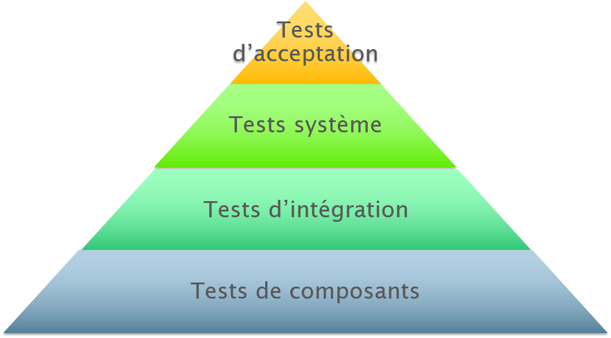

# Projet-8---Pur-Beurre For Open Class Room
## This project is made for the OpenClassRoom course (DA PYTHON)

## What is this project and how it works ?
This application retrieve products from the OpenFoodFact API. We store it in database. Then, we can compare products
and add subsitutes in favorite in your personnal space.

## To install the project on your pc, please follow these instructions:

### 1 - Fork the project

### 2 - Clone the project on your PC

### 3 - Create and set the database
In this case i use postgresql, but we can use an other db engine.

**STEP 1 :** 
Create a database.

```sql
createdb <your database name>
```

**STEP 2:**
Create your virtualenv in this path: Projet OpenClassRoom/Projet-8-Pur-Beurre.

```bash
virtualenv env -p python3
```

**STEP 3 :** 
Setting up the database in PurBeurre/settings.py

```python
DATABASES = {
    'default': {
        'ENGINE': 'django.db.backends.postgresql',
        'NAME': '<your database name>',
        'USER': '<your username>',
        'PASSWORD': '',
        'HOST': '',
        'PORT': '5432',
    }
}
```

**STEP 4 :**
Migrate the model into the database

*you must be at this location to launch the command: Projet OpenClassRoom/Projet-8-Pur-Beurre/PurBeurre*

```bash
./manage.py migrate
```

**STEP 5 :**
Launch the server with the following command

```python
./manage.py runserver
```

Then go to localhost: http://127.0.0.1:8000/

Search a product in the input field and have fun :)

### BONUS - Basic commands to run the project


#### Migrate data models

```python
./manage.py showmigrations
./manage.py makemigrations
```

#### Launch tests

It will launch the test to check if the project is still viable or has errors.

```python
./manage.py test search_food
```

#### Check the test coverage

This show the coverage of the code.

```python
coverage run --source='.' manage.py test search_food
coverage report
```

### Check the lint check

If you want to see clean jobs, execute this command:

```bash
pylint --load-plugins pylint_django search_food/
```

This project was made by Martin Gaucher for Open Class Room.


---------------
# Partie Livrable - Plan de test

## Sommaire

### 1 - Pourquoi tester ?

### 2 - Quoi tester ?

### 3 - Comment tester ?

### 4 - Qui teste ?

### 5 - Livrables

--------

# 1 - Pourquoi tester ?

Un jour, un grand homme m'a dit : 
> Tester, c'est douté.

Une citation avec laquelle je suis entièrement d'accord. Mais pas dans
notre cas.

Le doute s'invite justement lorsque des tests ne sont pas effectués avant le
déploiement d'une application. Surtout lorsque cette dernière n'a pas été
mise à jour depuis quelques mois.

On pourrait tout simplement lancer le projet, comme si de rien n'était
et débugger tout le code à la main pendant des heures sans savoir ce qui va
ne pas fonctionner après la correction du précédent bug.

Alors que si nous lançons un test avant, on voit ce qui ne va pas directement 
ou bien si tout est vert, on peut lancer l'application sereinement.

* Plus concrètement, quels sont les objectifs à atteindre ?

Les objectifs des tests servent à :

*Péréniser un projet*  
*S'assurer du bon fonctionnement avant une utilisation*  
*Tester les limites de l'application*  
*Cela permet d'économiser de l'argent*

**Aparté :**

Je travaille dans une entreprise qui intégre un progiciel (Odoo). J'ai parlé
avec mes collègues, de tests.

Et le constat fût surprenant puisque qu'il y a très peu de développeurs qui
réalisent des tests au sein de ma société. Et rare sont les clients qui veulent
payer plus cher pour se munir d'une batterie de tests (qui seraient pourtant
utiles) afin de solidifier leurs Odoo. 

Pour cette application, je pense que des tests sont nécessaires. Car PurBeurre
est une application qui travaille avec un ORM (base de donnée) et qui récupére
des données par le biais d'une API. 

# 2 - Quoi tester ?

> Dans cette aplication, que devons-nous tester ? Pour commencer, nous allons
> lister les fonctionnalités de l'application qui sont importantes pour
>l'expérience utilisateur.

## Liste des fonctionnalités principales de l'application

- Système d'authentification
    - Connexion
    - Inscription
    - Déconnexion

- Recherche du produit
    - Vérifier si l'api n'a pas changé et renvoi toujours le même
    format de données à exploiter
    - Vérifier si les produits rentrent bien en base de donnée

- Recherche dans la base de donnée grâce à l'ORM
    - Vérifier si les produits sont bien présents en base de donnée
    - Vérifier si les informations renvoyées sont les bonnes

- Le système de Favoris
    - Les favoris sont bien ajoutés dans l'espace de l'utilisateur
    - Unicité des favoris

# 3 - Comment tester ?

> La réponse à cette interrogation se décompose, en fonction des objectifs des 
> tests comme suit :

 - Spécifier les niveaux, types et méthodes de tests (cas de tests)
 - Définir les ressources matérielles adhéquats (configuration matérielles,
logicielles, outils de production...)

### Les niveaux de tests 

Il y a plusieurs niveaux de tests représentés par une pyramide.


### Les tests de composants / unitaires

Les tests unitaires (aussi appelé test de composants) permettent de vérifier
le bon fonctionnement d'une partie précise d'un logiciel ou d'une portion
d'un programme.

### Les tests d'intégration

Le test d'intégration permet de vérifier l'aspect fonctionnel, les performances
et la fiabilité du logiciel. Il détecte les erreurs que ne peut détecter les
tests unitaires.

### Les tests système

Dans ce projt il n'est pas demandé d'effectuer ce genre de tests. Ces derniers
servent à tester les charges sur un serveur et bien d'autres fonctionnalités.

### Les tests d'acceptation

Les tests d'acceptation vérifient  que l'application est conformes aux
spécifications. Cette partie n'est pas non plus demandée dans ce projet.

## Système d'authentification


# 4 - Qui teste ?

# 5 - Livrables